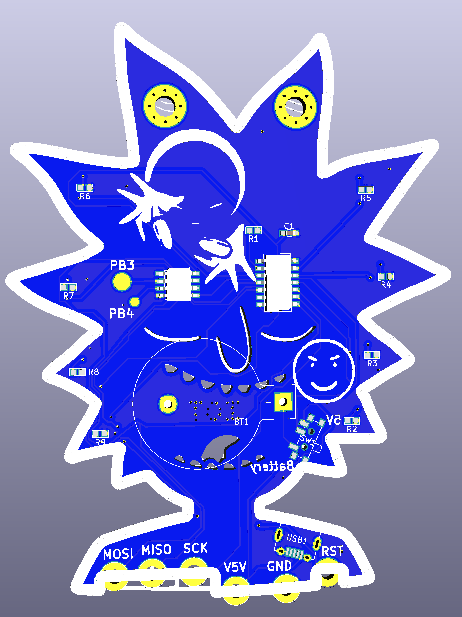

# Badge for comunity inspired in Rick from Rick and Morthy.
PCB created with KiCad.

Circuit consists of an Attiny13A-SU and a shift register 74164 8 bit serial to parallel shift register.
The circuit includes a batter holder for a CR2032 battery.
Circuit also has 8 Leds.

As the moment of pushing repository circuit has never been tested.

