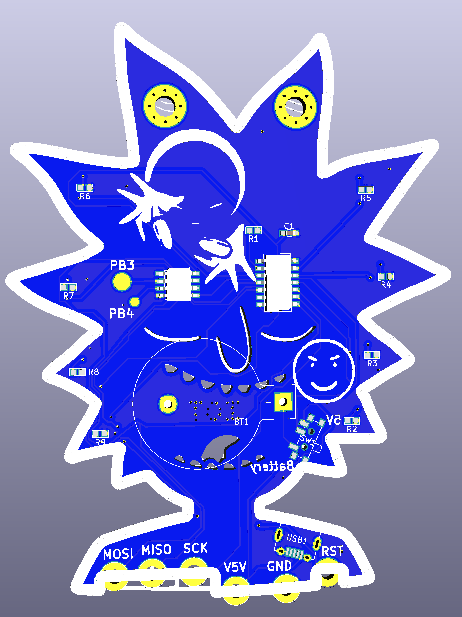

# Overview

Information about HackerLab V3 Hardware badge. On June 22, 2019 we hosted our anual HackerLab [@Engine4](https://twitter.com/engine4cws/) in Puerto Rico. Our HackerLab main goal is to provide a space for hackers to play and learn about different aspect of security specially IOT stuff.
As part of our activity, every (well almos everyone) participant takes home a special hardware badge for them to play, hack or do what ever they want with them. And this is the place to find the information about such fantastic piece of hardware. Enjoy and feel free to comment on our github [project repo](https://github.com/soynerdito/RickBadge).

#Design files

All design files are open source and free for everyone to download modify and make their ouwn from our [Github repo](https://github.com/soynerdito/RickBadge "Badge Repo"). The making of this badge was done using free open source tools like, KiCad, LibreCad and Inkscape. And of course the help of one or two seach engines and Youtube as always.
Components were source from ebay and making of the actual PCB board was done in China. All soldering was a labor of love with a soldering iron and patience.

First design sent to fabrication looked like this. This are KiCad renderings of the board before being manufactured.

#Components
All Components are [smd components](https://en.wikipedia.org/wiki/Surface-mount_technology) specially 0603 size as they are easier to solder by hand.
Bill of material is:

Qt | Part Number | Description | Footprint
-- | ----------- | ----------- | ---------
7 | Led | Regular Led | 0603
8 | 680 Ohm | Resistor | 0603
1 | 12K Ohm | Resistor | 0603
1 | 10uF | Capacitor | 0603
1 | | Slide switch |
1 | CR2032 | 3V coin cell battery |
1 |  | Baterry Holder for CR2032 |
1 | Attiny13A | Atty micro controller | SOP8
1 | 74HC164 | 8 bit Shift register | SOIC14

#Programming

##Configuring Arduino

#Making my own badge

#References
